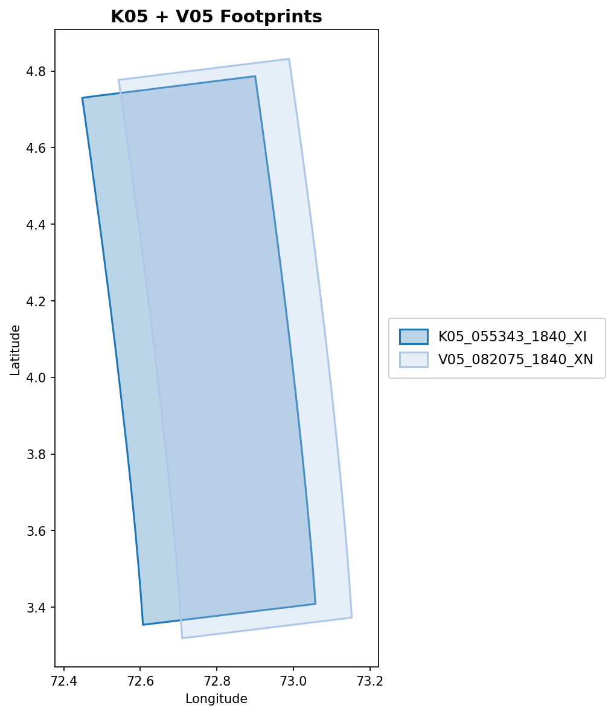
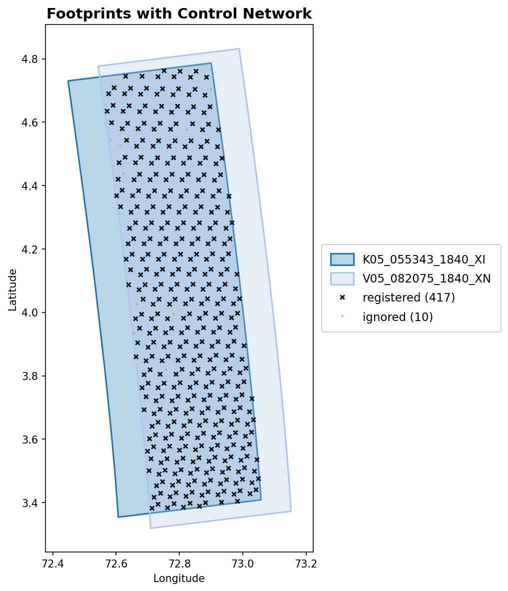

## Purpose

Interactive footprint map viewer for ISIS cube files. Shows image coverage
areas on a map with per-image coloring and optional control network overlay.
Also supports static PNG export for reports and publications.

## Usage

```bash
# Interactive browser viewer (default)
isistools footprints cubes.lis

# With control network overlay
isistools footprints cubes.lis --cnet control.net

# Native matplotlib window (with hover tooltips)
isistools footprints cubes.lis --win

# Static PNG export
isistools footprints cubes.lis --png
isistools footprints cubes.lis --png --title "MC-13E Gap Region" --dpi 200

# PNG with custom output path
isistools footprints cubes.lis --png-path my_overview.png
```

## Options

| Option | Default | Description |
|--------|---------|-------------|
| `--cnet`, `-c` | — | Control network file (`.net`) to overlay |
| `--png` | off | Save static PNG instead of launching viewer |
| `--png-path` | `footprints_overview.png` | Custom output path (implies `--png`) |
| `--dpi` | 150 | PNG resolution |
| `--title`, `-t` | cubelist filename | Figure title |
| `--win` | off | Native matplotlib window instead of browser |
| `--port`, `-p` | 0 (auto) | Server port for browser viewer |
| `--no-browser` | off | Start server without opening browser |

## Output modes

### Browser viewer (default)

Launches a Panel/HoloViews app in the browser with:

- Interactive pan, zoom, and box-select
- Per-image color coding with legend
- Hover info showing image metadata
- Optional control network point overlay

### Native matplotlib window (`--win`)

Opens a native Qt window with:

- Standard matplotlib zoom/pan toolbar
- Hover tooltips showing CTX product ID (via mplcursors)
- Per-image color coding with right-side legend

### Static PNG (`--png`)

Generates a publication-ready PNG using the headless Agg backend. No GUI
dependency — works on remote servers and in CI pipelines.

## Example

Two overlapping CTX images (K05_055343 + V05_082075) in the MC-13E gap region:

{#fig-footprints-example}

With `--cnet`, control network points are overlaid and color-coded by status
(registered, unregistered, ignored):

{#fig-footprints-cnet}

## Input format

The cube list file is a plain text file with one cube path per line. Blank
lines and lines starting with `#` are skipped:

```
# K05 and V05 level-1 cubes
/path/to/K05_055343_1840_XI_04N287W.lev1.cub
/path/to/V05_082075_1840_XN_04N287W.lev1.cub
```

## Python API

```python
from isistools.io.footprints import load_footprints
from isistools.plotting.footprint_mpl import footprint_png, footprint_window

gdf = load_footprints("cubes.lis")

# Static PNG
footprint_png(gdf, "overview.png", title="My Mosaic", dpi=200)

# Interactive window
footprint_window(gdf, title="My Mosaic")
```
